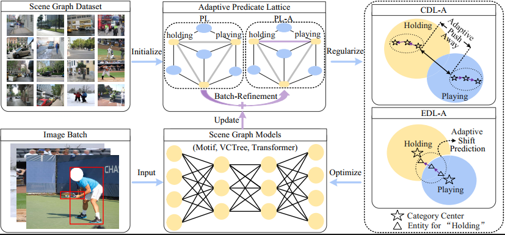

# FGPL

FGPL: Fine-Grained Predicates Learning for Scene Graph Generation.
In CVPR 2022.

FGPL-A: Adaptive Fine-Grained Predicates Learning for Scene Graph Generation.
In TPAMI (Under Rewiew)

Results

## FGPL

Go to https://github.com/XinyuLyu/FGPL

## FGPL-A

Go to https://github.com/XinyuLyu/FGPL-A
