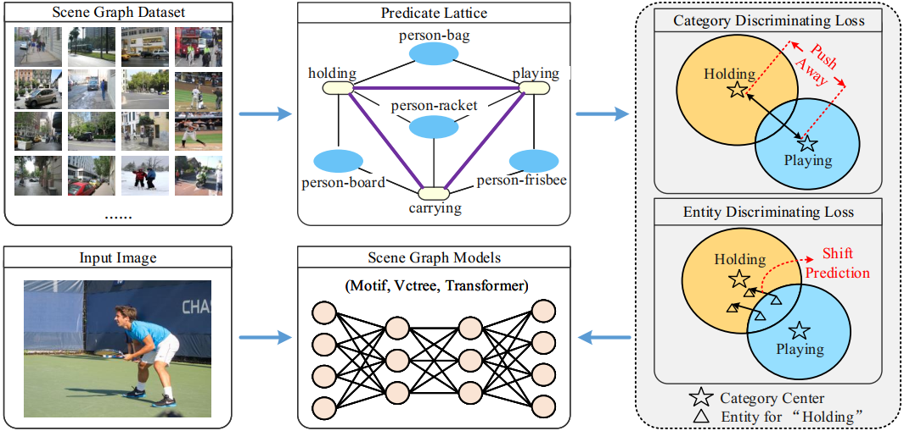

# FGPL/FGPL-A

## FGPL: Fine-Grained Predicates Learning for Scene Graph Generation. In CVPR 2022.

## FGPL-A: Adaptive Fine-Grained Predicates Learning for Scene Graph Generation. In TPAMI (Under Rewiew)

## Results

## FGPL

Go to https://github.com/XinyuLyu/FGPL

## FGPL-A

Go to https://github.com/XinyuLyu/FGPL-A
